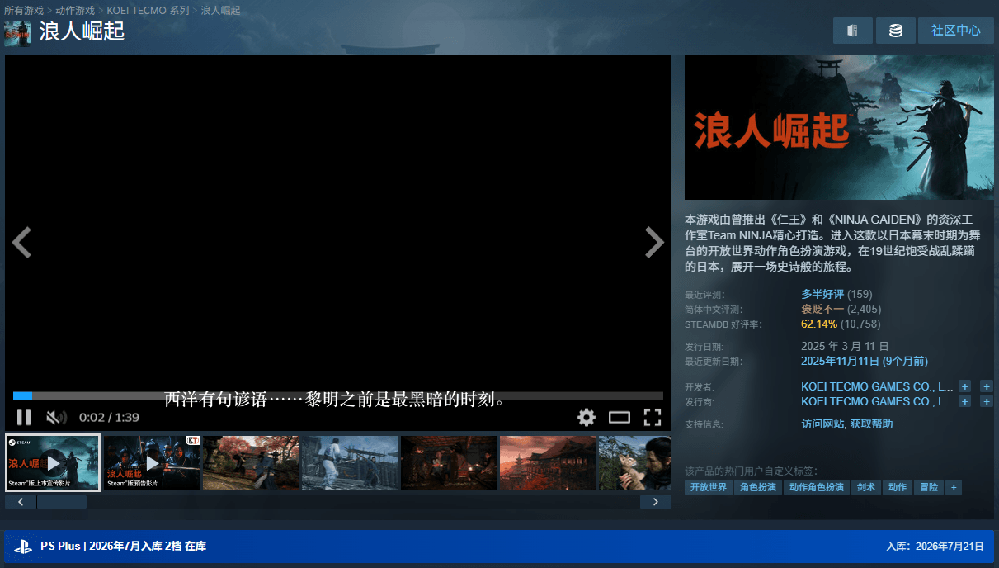
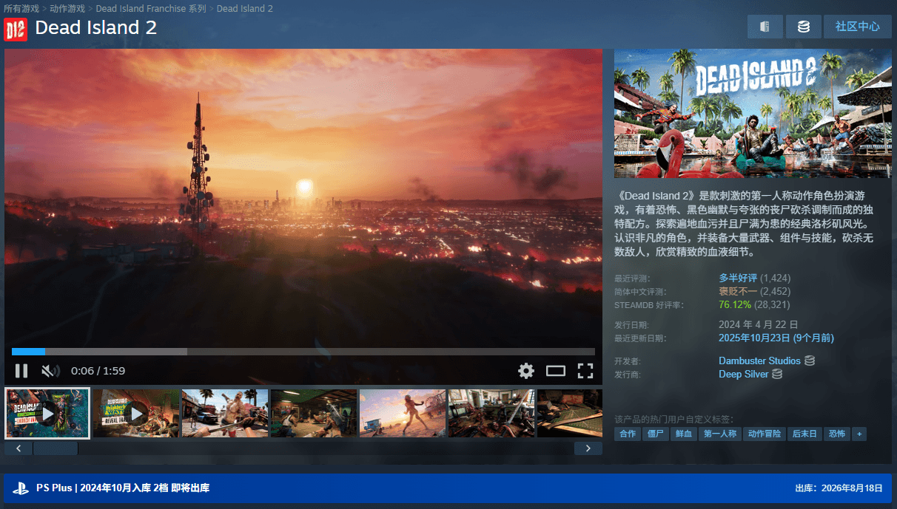
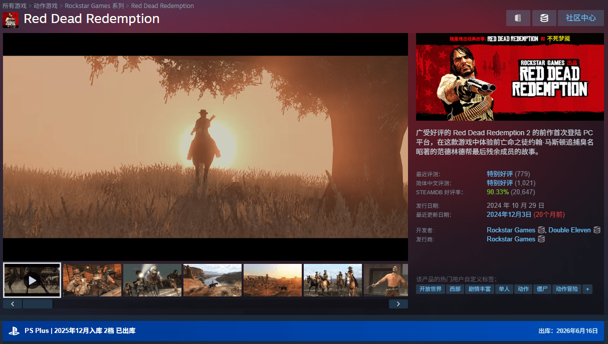
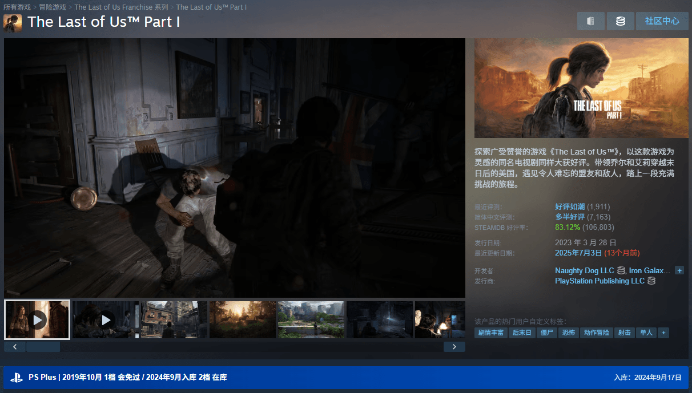
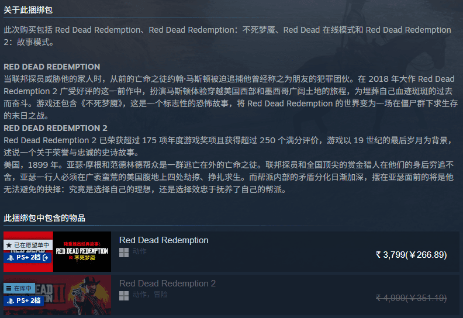
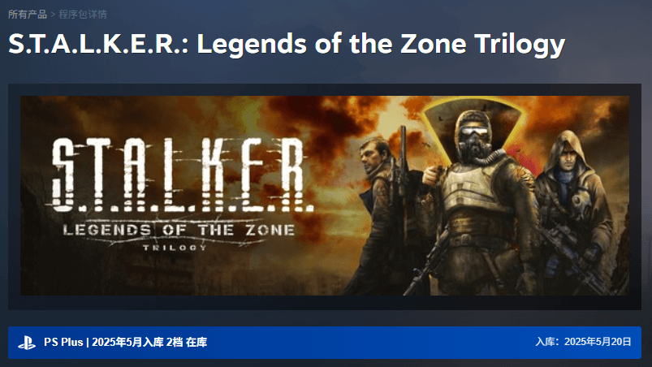
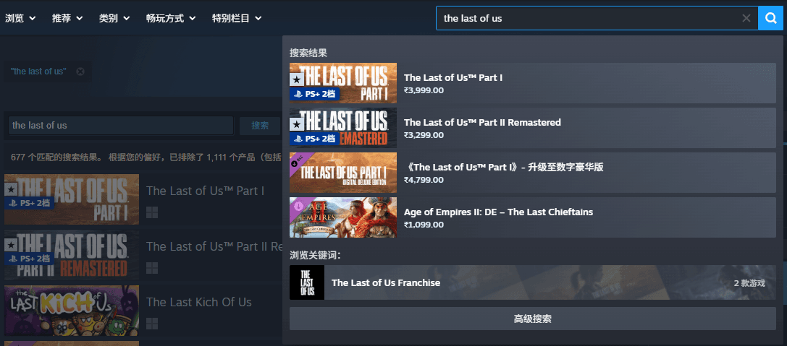

# Steam × PS Plus 会免游戏显示

**psplus-steam-overlay** 是一款 Tampermonkey 增强脚本，能帮助你在浏览 **Steam** 商店时，发现游戏在 **PS Plus** 各档位的状态（1 档会免 / 2·3 档入库）。

---

## 效果

| 页面 & 说明 | 截图 |
| :--- | :--- |
| 详情页，1档会免中 |  |
| 详情页，1档会免过 |  |
| 详情页，2/3档在库 |  |
| 详情页，2/3档即将出库 |  |
| 详情页，2/3档已出库 |  |
| 详情页，1档会免过，同时也在2档 |  |
| 捆绑包，已出库有图标显示 |  |
| 部分集合包 |  |
| 首页游戏卡片 |  |
| 搜索结果 |  |
| 愿望单 |  |

---

## 功能

* **页面适配**：支持 Steam 商店首页、搜索页、愿望单、游戏详情页
* **数据同步**：安装后首次访问 Steam 任意页面会自动从 Github 同步数据到本地，后续仅在仓库数据有更新时同步数据
* **数据来源**：由Workflow自动检查飞书表格数据更新，并自动匹配Steam AppID

---

## 快速开始

1. 浏览器安装 [Tampermonkey](https://www.tampermonkey.net/)。
    * [Chrome 商店安装](https://chrome.google.com/webstore/detail/dhdgffkkebhmkfjojejmpbldmpobfkfo)
    * [Edge 商店安装](https://microsoftedge.microsoft.com/addons/detail/iikmkjmpaadaobahmlepeloendndfphd)
    * [Firefox 商店安装](https://addons.mozilla.org/zh-CN/firefox/addon/tampermonkey/)
2. 安装脚本
    * [Github Raw](https://raw.githubusercontent.com/oXnMe/psplus-steam-overlay/main/userscript/steam-psplus.user.js) 更新数据也走的是 Github Raw 地址
    * [Greasy Fork](https://greasyfork.org/zh-CN/scripts/588437) 更新数据走的是 jsdelivr cdn 地址

---

## 更多

飞书多维表格由[斯凯范特西](https://space.bilibili.com/1386040715)大佬整理

大佬B站：[https://space.bilibili.com/1386040715](https://space.bilibili.com/1386040715)

如有显示问题、数据错误或其他Bug，请提[Issue](https://github.com/oXnMe/psplus-steam-overlay/issues)
